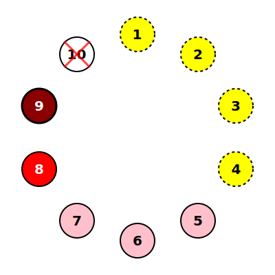
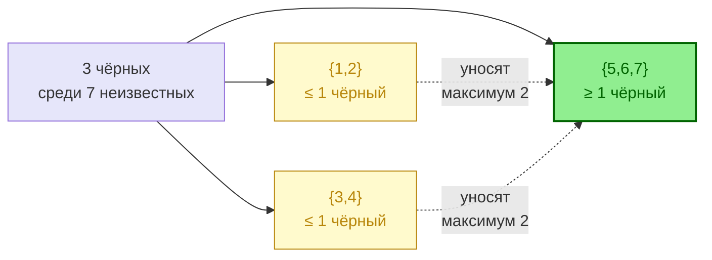

# Полная власть на 9: деление в сторону


Разбор позиции проверенного красного у ПУ шерифа


## Позиция

Вы - красный на номере 9. Игрок 10 (шериф) убит в первую ночь с проверкой: **9 — красный**. После первой ночи за столом 6 красных и 3 чёрных. У вас есть уверенность в одном красном цвете - 8. Вы и 8 — красные, значит в группе {1, 2, 3, 4, 5, 6, 7} есть 4 красных и 3 чёрных. Если у нас есть две связки, например, что 1 2 - не два черных, и 3 4 - не два чёрных, можно делить в сторону, поднимать непонятных игроков с высокой концентрацией чёрных.

## Что я знаю

| Игрок | Статус | Источник |
| :--- | :--- | :--- |
| **9** (я) | красный | проверка шерифа |
| **10** | красный | шериф |
| **8** | красный | по наблюдениям 1-го дня |
| **{1, 2}** | максимум 1 чёрный | парное ограничение |
| **{3, 4}** | максимум 1 чёрный | парное ограничение |
| **{5, 6, 7}** | неизвестно | — |

В худшем случае в {5, 6, 7} один чёрный, в лучшем — все три.

## Решение


**Принцип:** Выставляю игроков 5, 6 и 7.
* Гарантированно попадаю в минимум одного чёрного, если найденный красный цвет и две связки верны.


## Что может пойти не так


* Допущение «8 — красный» — фундамент всей логики. Если 8 чёрный, пирамида рушится. Перепроверь основания **до** выставления.
* Парные ограничения {1,2} и {3,4} — эвристика, а не теорема. Назови факты, на которых они построены.

