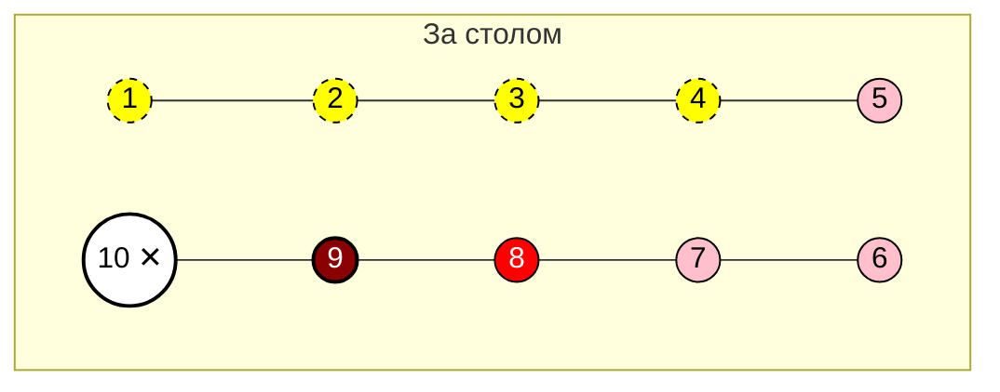
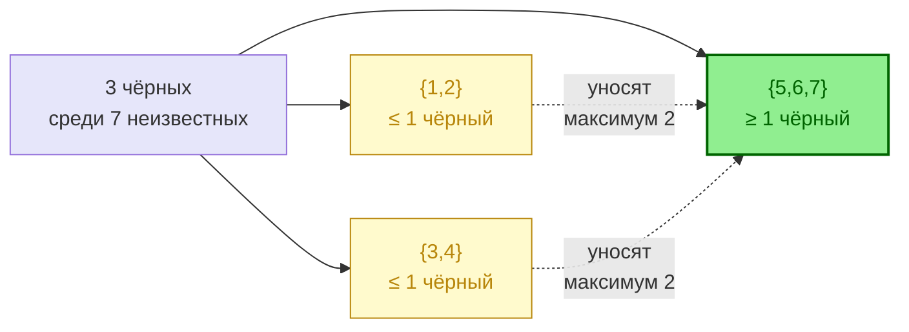

# Полная власть на 9: где искать чёрных


Разбор позиции проверенного красного у ПУ шерифа


## Позиция

Вы - красный на номере 9. Игрок 10 (шериф) убит в первую ночь с проверкой: **9 — красный**.

**Легенда.** Все круги с чёрной окружностью. Белый круг с крестиком поверх — мёртвый. Тёмно-красный — я. Красный — точно красный. Жёлтый пунктир — связан парным ограничением. Розовый — целевая группа.

## Что я знаю

| Игрок | Статус | Источник |
| :--- | :--- | :--- |
| **9** (я) | красный | проверка шерифа |
| **10** | красный | шериф |
| **8** | красный | по наблюдениям 1-го дня |
| **{1, 2}** | максимум 1 чёрный | парное ограничение |
| **{3, 4}** | максимум 1 чёрный | парное ограничение |
| **{5, 6, 7}** | неизвестно | — |

## Куда деваются три чёрных

После первой ночи за столом 6 красных и 3 чёрных. Я и 8 — красные, значит в группе {1, 2, 3, 4, 5, 6, 7} есть 4 красных и 3 чёрных.

В худшем случае в {5, 6, 7} один чёрный, в лучшем — все три.

## Решение

**Выставляю игроков 5, 6 и 7.**

* Гарантированно ловлю чёрного, если найденный красный цвет и две связки верны.
* Сжимаю неопределённость в самой плотной по чёрным группе.
* Не трачу ход на {1, 2} и {3, 4} — там парные ограничения уже работают на красных.


**Принцип:** при полной власти выставляй группу с максимальной плотностью чёрных целиком. Не разбрасывайся по подозреваемым из уже сбалансированных пар.


## Что может пойти не так


* Допущение «8 — красный» — фундамент всей логики. Если 8 чёрный, пирамида рушится. Перепроверь основания **до** выставления.
* Парные ограничения {1,2} и {3,4} — эвристика, а не теорема. Назови факты, на которых они построены.

