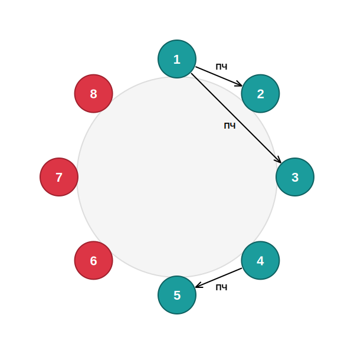

---
layout:
  outline:
    visible: false
---

# Деление четверых при закрытых версиях

## Позиция

|  |  |
| :--- | :--- |
| *Я* | 8, красный |
| *Отстрелы* | 10, промах |
| *Голосование* | 9 |
| *Версии* | 1: 2 чёрный, 3 чёрный. 4: 5 чёрный, 9 чёрный |

## Возможные проблемы


Игра в баланс — съём чёрной проверки от 1 и дальнейшее поражение при игре в две версии.


## Что решает проблему


В такой ситуации реализуем подъём четверых. Он даёт дополнительный съём и позволяет заголосовать суммарно 6 игроков: одного при девятерых, четверых при восьмерых и одного при троих. Это как раз 3 чёрных в двух версиях.

Частая ошибка — отказываться от деления из опасения, что возможен слом, который приведёт к поражению 3в3. Правильно организованное деление исключает такой риск.



Назовём большой командой ту версию, где три чёрных за столом, малой — ту, где их двое.

Принципы, по которым организуется голосование:
1. *Выбор кандидатур*. Поднимать можно *любых* четверых игроков, находящихся в версиях.
2. *Порядок выставления*. Важен для защиты от 3в3. В идеальном случае под первые руки выставляются представители малой команды, а под последние — большой. У большой команды не хватит рук, чтобы сломать в малую под первые руки. А если попробует сломать дальше — на голосовании уже стоит ранее обсуждённая жертва из большой команды, и мы спокойно добиваем её в баланс.
3. *Порядок голосования*. Нужен только для страховки от риска проиграть 3в3 большой команде. Поэтому первыми голосуют игроки большой команды. Их руки нужно израсходовать как можно раньше, чтобы осталось как можно больше неиспользованных красных рук, которые добьют одного из большой команды.
4. *Кого добиваем в случае слома*. Любого из большой команды. Единственное, что важно — номер добиваемого должен быть обсуждён при построении деления, чтобы все добивали одного и руки не разлетелись. Удобнее всего добивать последнюю кандидатуру.


Пример использования принципов в этой игре.
Большая команда — 2 3 4, малая — 1 5.
1. *Выбор кандидатур*. Поднимаем 1 2 3 4, подразумевая уход игрока 5 при троих, если игра не закончится.
2. *Порядок выставления*. Под первые руки выставляем малую команду — 1. Далее большую — 2 3 4.
3. *Порядок голосования*. Сначала тратим руки большой команды. В первую кандидатуру проголосуют 2 3, во вторую — 4 и любой из оставшихся. Дальше порядок использования рук неважен — все руки большой команды уже использованы, риск устранён.
4. *Кого добиваем в случае слома*. Представителя большой команды — для удобства пусть это будет 4 (выставлен последним).

Итого:
- В 1 голосуют 2 3
- В 2 голосуют 4 5
- В 3 голосуют 1 6
- В 4 голосуют 7 8

Всегда поднимаем деление, так как это 100% победа.


В случае слома матпобеда сохраняется, так как нарушивший деление своим сломом сообщает, что он чёрный, соответственно, мы знаем всю чёрную команду.



Никогда нельзя делить четверых, если по обеим версиям за столом 3 чёрных игрока. В момент деления есть запас на 5 съёмов при 6 чёрных игроках на две версии, запас не позволяет закрыть обе версии.

