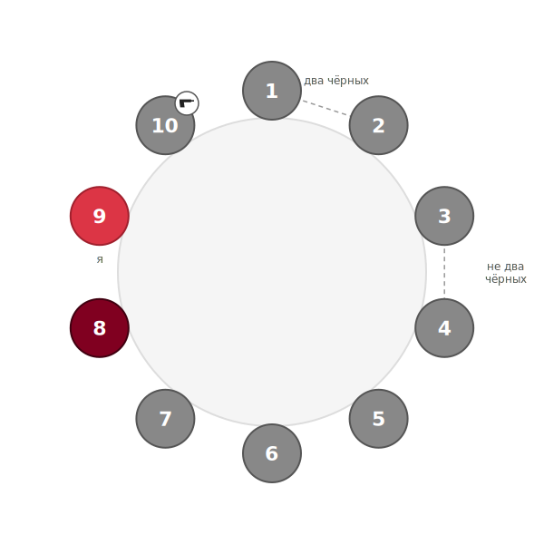

# Полная власть на 9: деление в сторону

## Позиция

|  |  |
| :--- | :--- |
| **Стол** | 9 живых, после первой ночи (6 красных + 3 чёрных) |
| **Я** | игрок **9**, красный |
| **Умер** | игрок **10** — шериф, ПУ в первую ночь |
| **Вскрылся** | шериф (10) с проверкой «9 — красный» |
| **Известные красные** | **8** (по наблюдениям дня 1) |
| **Связки «не два чёрных»** | {1, 2}, {3, 4} |


Я и 8 — красные → в {1–7} остаётся **4 красных и 3 чёрных**. Каждая связка уносит максимум одного чёрного, обе вместе — максимум двух → **минимум один чёрный сидит в {5, 6, 7}**.


## Возможные проблемы


**8 может оказаться чёрным.** Его красность держится на наблюдениях, не на проверке. Если 8 чёрный — в {1–7} всего 3 красных и 4 чёрных, и связки уже не гарантируют чёрного в {5, 6, 7}.



**Связки могут быть невалидны.** «Не два чёрных» — это эвристика по поведению, а не теорема. Если, например, {1, 2} оба чёрные — {5, 6, 7} могут оказаться все красными.


## Что решает проблему


**Выставляю 5, 6, 7.** При исходных допущениях (8 — красный, обе связки валидны) гарантированно попадаю минимум в одного чёрного — день не пустой.



Перед выставлением проговори основания вслух: какие факты держат связки, на чём держится красность 8. Если 8 шатается — рассмотри его в составе тройки вместо одного из {5, 6, 7}.

