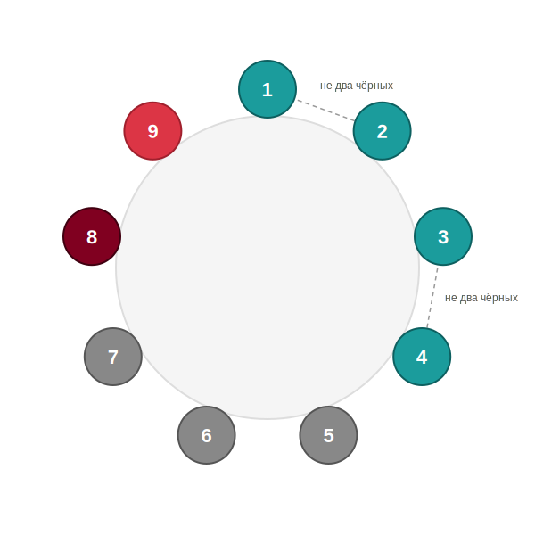

---
layout:
  outline:
    visible: false
---

# Проверенный красный у ПУ шерифа: деление в сторону

## Позиция

|  |  |
| :--- | :--- |
| *Я* | 9, красный |
| *Отстрелы* | 10 |
| *Голосования* | |
| *Версии* | 10: 9 красный |
| *Красные цвета* | 8 (по наблюдениям дня 1) |
| *Связки «не два чёрных»* | {1, 2}, {3, 4} |

## Возможные проблемы


Деление трёх красных на 3в3



Деление без плана на игру после подъёма


## Что решает проблему


Я и 8 — красные → в {1–7} остаётся **4 красных и 3 чёрных**. Каждая связка уносит максимум одного чёрного, обе вместе — максимум двух → **минимум один чёрный сидит в {5, 6, 7}**.



**Деление 5, 6, 7.** При исходных допущениях (8 — красный, обе связки валидны) гарантированно попадаю минимум в одного чёрного. Более того, после подъёма на круг при пятерых будут оставлены красный цвет и две связки, которые уменьшают комбинаторную сложность игры.

